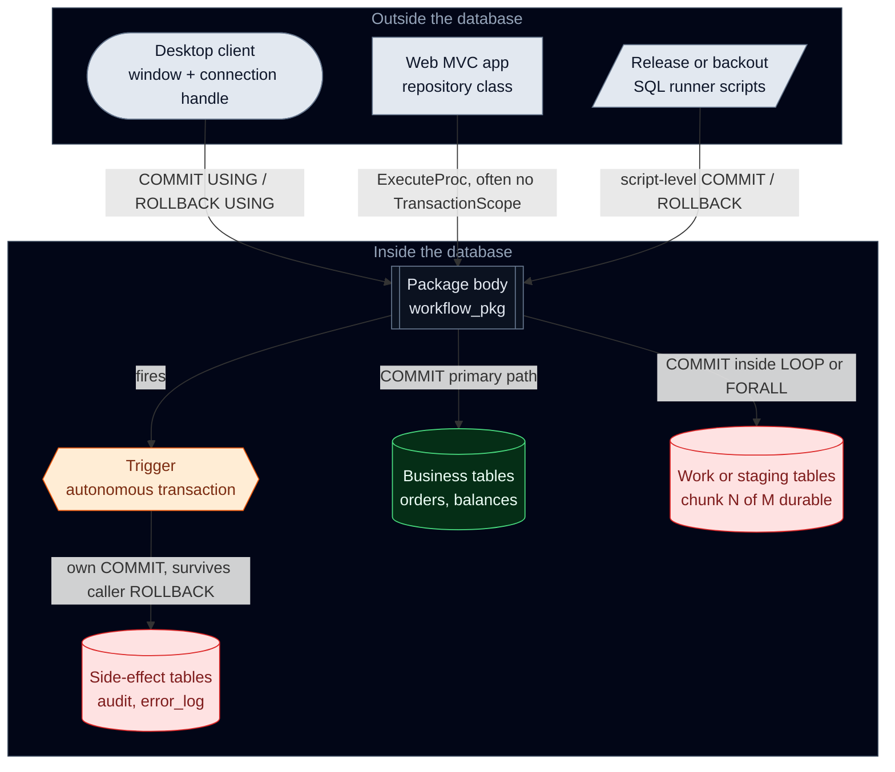

# Tripping on ACID

### Notes on cross-boundary transaction hijacking

*What I noticed about commit ownership drifting across packages, triggers, scripts, and clients — in one horribly complex system I help maintain*

---

Let's start with the good news: your database is (probably) not on drugs.

The bad news? Its transaction boundaries might be absolutely tripping. Mine were.

I could not answer a simple operational question about systems I work on every week: *who decides when this operation becomes durable?* Not which service owns the API. Not which team owns the package. *Who issues the `COMMIT` that makes the state real?*

I am not writing this as the authority on those systems. I am the person who got tired of not knowing. After enough half-done data and residual side effects, that question became a private obsession — a hobby I did not consent to. What I kept finding was a small set of ways *our* stack could **hallucinate who owns the transaction**: partial-persistence loops, rollback-then-commit exception flows, autonomous triggers that survive rollbacks like cockroaches in a fallout shelter. Still in production. Still ruining Mondays.

**What this is:** notes from grepping and incident-chasing one multi-tier estate — costs I saw, shapes in the code, questions that helped me stop guessing.

**What this is not:** a universal diagnosis, "delete every `COMMIT`," a claim every shape is always wrong, or a finished fix story. Some patterns are intentional policy. Most of what bit us was *undocumented* ownership, not the keyword itself. Your estate may rhyme; it will not be identical.

The jokes are free. The residual rows are not.

> Patterns below are from real code paths I touched. Comedy is a coping mechanism, not a severity rating — and not a claim that I have this solved.

Shapes come from a large **Oracle PL/SQL + fat-client desktop + ASP.NET** mess. If you have more than one layer that can finalize work, you may recognize the *shape* even if the dialect differs.

## When durability becomes a suggestion

I can usually answer who owns a service endpoint. I often could not answer who owns `COMMIT` on a multi-layer write path.

When ownership is ambiguous, independent control points fire on one logical operation: a desktop client with `COMMIT USING`, an app repository that never opens a `TransactionScope`, a package body that commits mid-workflow, an autonomous trigger with its own durability channel, a release script that decides rollback policy on the way out. None of that was exotic in our tree. Each piece was locally rational. Together, durability stopped feeling like a designed boundary and started feeling like an emergent outcome of whichever layers ran — often undocumented, occasionally contradictory, invisible until something broke. `COMMIT` felt less like an authoritative command and more… like a suggestion.

Working label I ended up using — **transaction boundary hijacking**: any layer that changes durability outcome outside a clear ownership contract — commits it did not own as the boundary, side effects that outlive upstream rollback, atomic units sliced by hidden intermediate commits, or durability coupled to object mechanics (`ON COMMIT` refresh) instead of policy. The cases that confused me were not "someone used `COMMIT`." They were "someone used `COMMIT` where it rewrote the contract I *thought* the caller had."

The framing that helped: a transaction boundary is control-plane machinery. When multiple layers can override it unilaterally, atomicity and recoverability stop behaving like guarantees and start behaving like path accidents. ACID properties stop reading like properties. They start reading like vibes.

How the objects lined up in our stack — call sites and in-database things, each able to finalize something:





## Where it actually hurt

Grep counts only mattered once I connected them to pain I had already felt:

- **Atomicity** — Intermediate commits left neither-committed-nor-rolled-back state. Schrödinger's transaction; no clean recovery point.
- **Recoverability** — Residual rows outlived the "failed" work. We could not roll back reality; we reconciled it.
- **Debuggability** — Cross-layer graphs by hand. Murder weapon: a SQL keyword; suspects: every tier.
- **Blast radius** — Shared packages made one batch-era choice ambient law for paths nobody on the call had reviewed — 2005 Makefile energy.
- **Change cost** — Touching a `COMMIT` sometimes meant touching an undocumented checkpoint. Without idempotency first, "cleanup" looked like its own outage risk.
- **Organizational cost** — Hard to put on a slide: incident time, reconciliation past budget, migrations that could not match *accidental* durability semantics.

For us this was not a style argument. It was a reliability and cost problem dressed as "how we've always done batches."

## How the trail started

The suite is multi-decade: several database schemas, fat-client desktop, MVC web (core OLTP/batch, interface ingest, service-bus inbox, web admin, desktop writers, ASP.NET calling stored procedures). Our team owns the app, release, and desktop surface; DBAs partner on the database estate. The last of the original SMEs — the people who could still tell you *why* a given path committed where it did — retired in 2024. After an incident left durable state nobody on the call could attribute, I asked *who committed this?* Nobody knew — not the DBA on the bridge, not the people on our team who ship those layers, and there was no longer an original designer to ping. That is not a flex. That is the whole point. The question stuck because *I* could not answer it either, and the oral history had walked out the door.

No funded study. No research mandate. A person with `grep` and dread, poking at files I already had open for other reasons. I searched for boundary primitives — `COMMIT`, `ROLLBACK`, `SAVEPOINT`, `PRAGMA AUTONOMOUS_TRANSACTION`, DDL via `EXECUTE IMMEDIATE`, `ON COMMIT`, client `COMMIT USING` / `ROLLBACK USING`, app `TransactionScope` / `BeginTransaction` — and noted what tended to show up together. Comment noise got in the way; uncommon forms got a second pass (`ROLLBACK TO`, `SET TRANSACTION`, `DBMS_TRANSACTION`). Match counts were triage for me, not bug tallies; active vs commented-out autonomous pragmas still need a human eye.

**What fell out of that mess:** a hundred "unique" package problems started looking like the same few behaviors under different names. The C# layer almost never owned transactions in the code I opened; it delegated into the database. Mid-incident I did not want a catalog — I wanted shapes I could recognize while grepping. For this estate, they settled into **six**.

I am not claiming exhaustiveness for every estate on earth. For *this* corpus, under static search, new files usually re-hit one of these six rather than inventing a seventh. Runtime-built SQL can still surprise me.

## How it showed up for me

**The batch that cannot start over.** `COMMIT` inside loops or after each chunk. Failure at chunk *k* left 1..*k−1* durable. Retry only made sense when it was idempotent and position-aware. Multi-stage "milestone" commits felt like the same idea with better names.

**The failure path that still leaves a scar.** `ROLLBACK`, write error/audit, `COMMIT`. Fine when independent side-effect durability is written down as policy. In the packages I opened, it usually was not. Road to data hell: good intentions and `EXCEPTION WHEN OTHERS`.

**The callee that owns durability for the caller.** "Composable" procedures that commit themselves — and then you cannot compose them. Variants I hit: `COMMIT WORK`, `DBMS_TRANSACTION`, savepoint slicing invisible to outer callers.

**The side effect that survives the undo.** Autonomous triggers and package routines. Caller rolls back; autonomous work may not. Sometimes that is exactly what audit wants. Undocumented, it became the residual row in the incident notes.

**The commit that does more than you wrote.** Runtime DDL via `EXECUTE IMMEDIATE` (implicit commits); `ON COMMIT` refresh expanding a commit beyond the DML on the screen.

**The layer that thought it was a guest.** Desktop `COMMIT USING` (Save as final boss of disk); release scripts with their own policy; web repos that only call procedures — innocent C#, opinionated package body.

When a new file made me wince, it was almost always another instance of one of these six — not a brand-new kind of magic. In *this* tree, anyway.

## What it looked like in code

Anonymized shapes from patterns I kept seeing. Names are generic stand-ins, not production identifiers.

```sql
-- Chunk commit: throughput in, atomic restart out
FOR i IN 1 .. CEIL(l_total / l_chunk_size) LOOP
   FORALL j IN l_from .. l_to
      INSERT INTO work_table VALUES l_rows(j);
   COMMIT;  -- progress checkpoint, not a business boundary
END LOOP;
```

Efficient until mid-batch failure. Recovery only worked for us when it knew chunk identity.

```sql
-- Failure that still mutates durable state
BEGIN
   perform_main_work();
   COMMIT;
EXCEPTION
   WHEN OTHERS THEN
      ROLLBACK;
      INSERT INTO error_log(error_details, error_time)
      VALUES (SQLERRM, SYSTIMESTAMP);
      COMMIT;
      RAISE;
END;
```

Two durability outcomes. Fine if specified. Bad if discovered from leftover rows at 2 a.m.

```sql
-- Autonomous trigger: audit may outlive the business update
CREATE OR REPLACE TRIGGER trg_audit_row_changes
BEFORE UPDATE ON domain_rows
FOR EACH ROW
DECLARE
   PRAGMA AUTONOMOUS_TRANSACTION;
BEGIN
   INSERT INTO row_change_audit(row_id, old_status, new_status, changed_by)
   VALUES (:OLD.id, :OLD.status, :NEW.status, USER);
   COMMIT;
END;
```

If that independence is intentional, I wish it had been written down. Otherwise the audit outliving the update that "never happened" is a nasty surprise.

```text
-- Client-owned boundary (desktop / 4GL-style)
IF update_succeeded THEN
   COMMIT USING connection_handle;
ELSE
   ROLLBACK USING connection_handle;
END IF
```

On this path the UI owns durability. Any backend assumption that "we control composition" is wrong here.

```csharp
// App looks neutral; package may not be
db.ExecuteProcNoReturn("workflow_pkg.apply_changes_prc", payload);
```

Black box at the call site; opinions about disk downstairs.

## Why I missed it for so long

In our world, local patches optimized one symptom ("always keep the error log") without re-deriving the durability contract. Historical constraints ossified into cargo cult after the constraint died. Org-chart ownership is clearer than the runtime story: our team already owns app, release, and desktop, and we work with DBAs on packages and schemas — yet durability still had no single *named* owner inside that mandate. Layers could each finalize work; the contract between layers was oral — and oral history does not survive a retirement wave. When the last original SMEs left in 2024, a lot of "ask so-and-so" answers left with them. We wrote endpoint contracts; we almost never wrote boundary contracts. Incident reviews fixed wrong data more often than they asked which layer was *allowed* to make it durable. Camouflage until I specifically grepped.

## I know what you're thinking…

**"In-loop commit is required for long batches."** Often true in our batch windows. Then the operation is not one atomic transaction; it is chunked durable processing. What helped was stopping the slide-deck fiction of all-or-nothing and talking about idempotency, replay, and chunk identity instead.

**"Autonomous triggers are required for audit."** Sometimes. Where policy really wants independent durability, fine — I just wish the policy lived somewhere greppable. Undocumented autonomy is what burned us. Residual-row discovery is a lousy design review.

**"The database owns transactions; the app should not care."** Coherent *if* ownership is explicit and visible in app contracts (outcomes, retries, partial failure). In the paths I opened, it was not. "App should not care" then meant "app cannot reason about failure." Bold. Expensive.

**"This is just bad code. Good teams don't have this."** I do not think our problem was one incompetent package — or four teams refusing to talk. Our team already owns app, release, and desktop; we still lost the path in the *seams between layers* (and between our stack and DBA-owned package territory), where no single review walks client → app → package → trigger → script. Competent people filled a vacuum locally, under deadline, for years. That includes me, when I shipped past a smell I did not have time to name.

## Lint I wish we had

Not enforced where I work. Wish list, not law:

- No `COMMIT` / `ROLLBACK` in reusable packages unless something is actually designated the boundary owner
- No new autonomous triggers without a written independent-durability note
- No exception `ROLLBACK` + side-effect `COMMIT` without a declared side channel
- No release scripts that silently redefine production transaction semantics
- App call sites that say whether ownership is app-managed or DB-managed

If a dangerous form can be written silently, it will be — under deadline. I say that as someone who has been the deadline.

## What I started counting

Rough dashboard for "how deep is this trip," not a maturity model:

- **Leading:** internal commits outside modules I already knew were boundary owners; active autonomous declarations; rollback-then-commit shapes
- **Lagging:** consistency incidents; how long it took to attribute a durable anomaly; partial-state backouts
- **Structural:** critical workflows where someone can name the durability owner; chunked workflows with any idempotency story at all

## Three questions I use now

On the next package I already distrust:

1. **Who can commit this business operation today?**
2. **Which side effects can survive rollback of the primary work?**
3. **Can a failed run be replayed without manual data surgery?**

Unclear answers are useful — they mean I finally named the confusion. If you fund the migrations rather than live in the packages, the parallel questions that helped conversations with leadership: how long is the committer list on a critical path, who owns side-effect durability policy, and could someone find those owners without tribal knowledge that may no longer work here? Long silence is data. It was for us — especially after 2024.

## Monday morning: the greps I actually ran

Not a product. Not complete. A starter kit for the curious. Hits are triage, not guilt. Adjust paths and dialects.

```bash
rg -n -S '\b(COMMIT|ROLLBACK|SAVEPOINT)\b'
rg -n -S 'PRAGMA\s+AUTONOMOUS_TRANSACTION'
rg -n -S 'EXECUTE\s+IMMEDIATE|ON\s+COMMIT'
rg -n -S 'COMMIT\s+USING|ROLLBACK\s+USING'
rg -n -S 'DBMS_TRANSACTION\.|COMMIT\s+WORK|ROLLBACK\s+TO'
rg -n -S 'TransactionScope|BeginTransaction|OracleTransaction' -g '*.cs'
```

I take a second look when I see: `COMMIT` inside `LOOP`/`FORALL`; `ROLLBACK` then `INSERT` then `COMMIT` in one exception block; autonomous pragmas in triggers.

## Closing

I am not selling architecture purity. I am saying that in *our* multi-tier mess, transaction boundaries behaved like architecture even when we treated them like syntax — and every layer that could type `COMMIT` eventually did. Durability drifted. ACID stayed true inside fragments. The global property I thought we had was path-dependent.

The system is not malicious. It is not even confused. It is just… tripping.

I have not fixed this estate. I have patterns I wish I had noticed years earlier, a vocabulary that made a few incident calls less chaotic, and proof — to myself — that the confusion is nameable. Naming was the first thing that helped. Everything after that is still work.

If any of this sounds familiar, pick a path you already distrust. Ask who owns the commit. Write the answer down somewhere more durable than a meeting.

You might not like what you find. Unlike the residual audit row, that answer can still roll back.

---

*Disclaimer: This post was crafted as a joint venture between myself, GPT-5.3-Codex, Deepseek V4 Flash, and Grok 4.5.*
